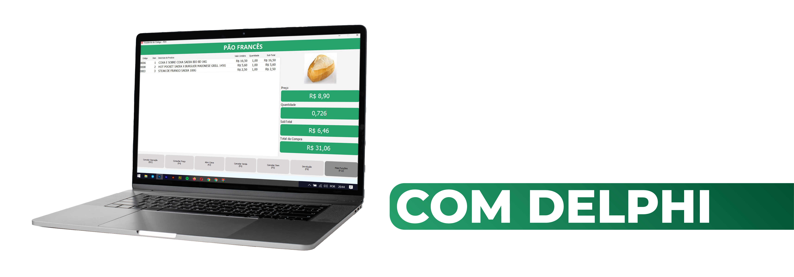

#

 

 
  
  
    

 

 
 
Neste treinamento focamos 100% nas técnicas existentes no Delphi, aplicando tudo que precisamos para que possa ser criado um PDV, que lhe dê a possibilidade de aumentar seu conhecimento, e aplicabilidade em conceitos usados na automação comercial.

 
Diversas empresas já trabalham com esse tipo de software, e você desenvolvedor que está dando seus primeiros passos, ou já está alocado em uma empresa que possui um sistema como esse, com os conceitos e desenvolvimento parecido como este.

 
Nós da Academia do Código nos preocupamos com o mercado de software e nos importamos com desenvolvedores que tenham conhecimento das diversas tecnologias e tenham maior assertividade do que precisão para solucionar problemas, ou até mesmo, criar o seu próprio software.

 

>
>### Quer saber mais sobre esse treinamento?
>### Acesse o link do nosso youtube e assista a nossa playlist, e venha fazer parte desse grupo seleto de desenvolvedores
>### Siga Nosso Instagram e faça parte do nosso grupo do Telegram
>